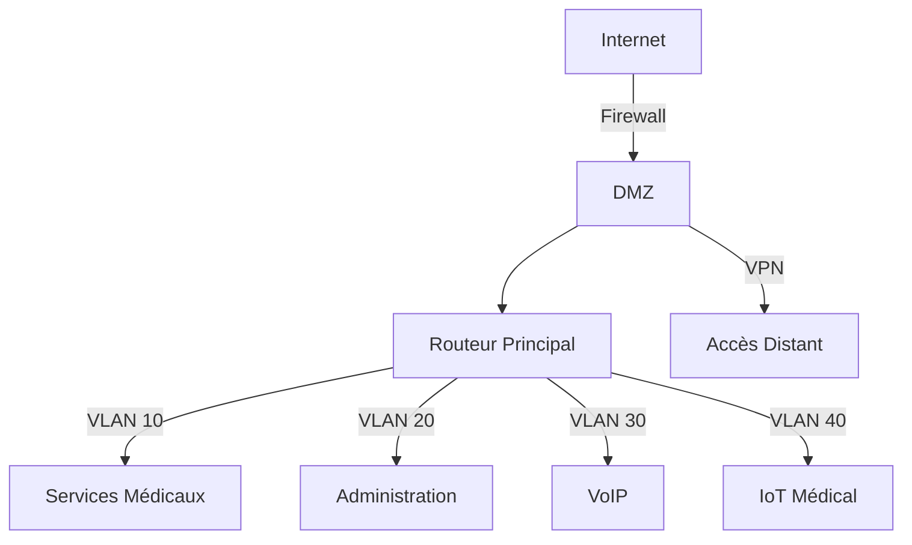

# 🏥 Réseau Hôpital de Campagne

Conception et implémentation d'une infrastructure réseau sécurisée pour un hôpital de campagne mobile. Ce projet vise à fournir une solution réseau robuste et sécurisée pour les déploiements médicaux d'urgence.

## 🎯 Objectifs du Projet

- Infrastructure réseau hautement disponible
- Sécurisation optimale des données médicales
- Communications unifiées pour le personnel médical
- Déploiement rapide et modulaire

## 🏗 Architecture



## 🛠 Technologies Utilisées

- **Réseau**
  - Cisco IOS (Routeurs & Switches)
  - VLANs pour la segmentation
  - HSRP pour la redondance
  - QoS pour la VoIP

- **Sécurité**
  - pfSense Firewall
  - Suricata IDS/IPS
  - VPN Site-to-Site
  - 802.1X Authentication

- **Communications**
  - Asterisk VoIP Server
  - SIP Trunking
  - Téléphones IP

## 🔐 Mesures de Sécurité

| Service | Protection |
|---------|------------|
| Données Médicales | Chiffrement AES-256 |
| Accès Réseau | 802.1X + RADIUS |
| Surveillance | IDS/IPS + Logging |
| Communications | TLS + SRTP |

## 📋 Prérequis

- Cisco IOS 15.x ou supérieur
- pfSense 2.6.0 ou supérieur
- Suricata 6.x
- Asterisk 18.x

## 🚀 Installation

1. **Configuration des VLANs**
```bash
# Sur le switch core
vlan 10
name MEDICAL
vlan 20
name ADMIN
vlan 30
name VOIP
vlan 40
name IOT
```

2. **Configuration du Firewall**
```bash
# Règles pfSense basiques
# Autoriser VLAN médical -> Internet (443/80)
# Bloquer tout autre trafic sortant
```

3. **Configuration VoIP**
```bash
# Config Asterisk minimale
[internal]
type=internal
context=internal
```

## 📈 Monitoring

- Surveillance temps réel via SNMP
- Alertes IDS/IPS
- Logs centralisés
- Métriques de performance réseau

## 🔍 Tests de Sécurité

- [x] Tests de pénétration réseau
- [x] Audit de sécurité VoIP
- [x] Vérification isolation VLAN
- [x] Tests de failover
- [x] Audit conformité RGPD

## 📄 Documentation

- [Guide d'installation détaillé](docs/installation.md)
- [Plan d'adressage IP](docs/ip-plan.md)
- [Procédures d'urgence](docs/emergency.md)
- [Politique de sécurité](docs/security.md)


---
Fait avec ❤️ par Locqmen HAMDI
Étudiant en BUT RT - Option Cybersécurité

